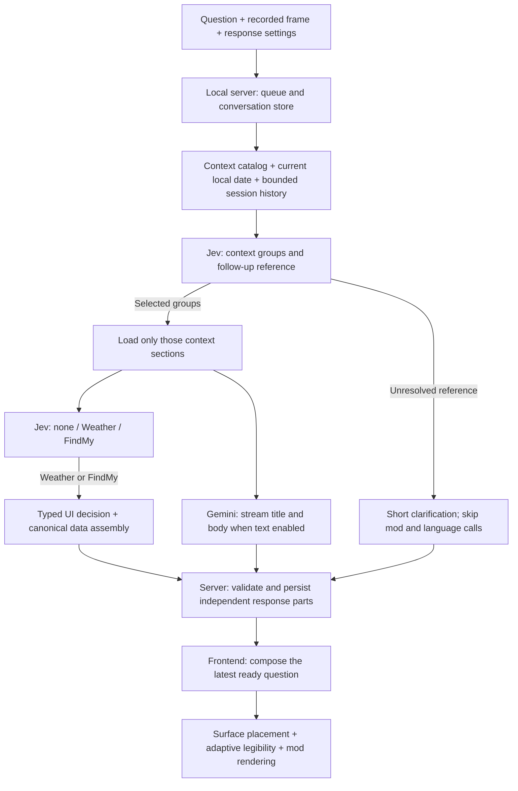

# Intelligent Spatial Interface

What might interacting with an AI agent look like beyond the screen? We envision AI blending calmly into everyday environments: talk to your room about the weather, books, cooking, or whatever is on your mind, and its responses become part of the space around you. We hope these interactions can augment analog life, supporting the activities, objects, and places we already care about.

This prototype explores that vision through spatial UI, contextual answers, and effects integrated into recorded rooms. Record with [Record3D](https://record3d.app/) on a LiDAR iPhone, import per-frame camera poses, and edit in a browser: the left view composites responses and objects over the recorded camera view, while the right view shows the room mesh and camera trajectory in a free 3D scene.

Derived from [ryosuzuki/quest-spatial-studio](https://github.com/ryosuzuki/quest-spatial-studio) (the Quest recorder and scenario pages live on its `main` branch).

## Setup

```sh
cd editor
npm ci
python3 -m venv .venv && .venv/bin/pip install -r requirements.txt               # import + LiDAR depth
python3 -m venv .venv-mesh && .venv-mesh/bin/pip install -r requirements-mesh.txt  # room mesh (open3d 0.18 needs numpy < 2)
npm start                          # http://localhost:8766
```

## Scene → Scan → Recordings

Three levels. A **scene** is one place (the folder `spaces/<scene>`). Its **scans** capture the static room and furniture, from any scanning app (Polycam, Scaniverse, a slow Record3D pass fused into a mesh); one of them is chosen. Its **layout** is metadata over the chosen scan, not a scan: labelled boxes for furniture, appliances, doors and windows, plus rooms, seeded from a RoomPlan export and corrected by hand. Its **recordings** are Record3D takes of everyday moments there, with the clutter of daily life on top of the scanned room (the folders `scenarios/<take>`); a scene can have many. A Record3D take that was fused into a scan is a scan source, not a recording.

```
editor/private/<scene>/scans/          raw exports of scanning apps (RoomPlan, Polycam, Scaniverse…), repairs/, archive/ (git-ignored)
editor/private/<scene>/recordings/     raw Record3D "EXR + JPG sequence" exports, one folder per recording (git-ignored)
editor/spaces/<space>/
  space.json                           frame (the export that defined the coordinates), scans[] (toSpace + registration each), scan (the chosen one), layout (its RoomPlan source)
  scan/<id>.glb                        one per scanning app, baked into the scene's coordinates; scan/roomplan.glb is the layout's source model
  scan/semantic.json                   the layout: objects and openings (oriented boxes: id, label, category, center, size, yaw, room, parent), and the room structure from
                                       RoomPlan: rooms (zones: polygon, triangles), walls (10 cm slabs with outline and the zones on either side), ceilings (pieces,
                                       normal, slope in degrees: the attic's are about 44°, and the zones under them); semantic.roomplan.json is RoomPlan's original
  context.json                         optional: what the assistant knows about the place (else agent/mock-context.json)
  scenarios/<take>/
    session.json                       frames, poses, intrinsics, depth index; toSpace = row-major 4x4 into the space's coordinates
    frames/  depth/  room.glb          images, LiDAR depth (PNG, mm), the recording's own mesh (optional)
    agent/<session id>.json            Q&A sessions
```

**Scene setup.** Every step is a command (`scripts/spaces.py`, the same functions the editor server calls), so a scene can be rebuilt from its raw exports, in this order:

1. **Scene**: `create home`.
2. **Layout** from a RoomPlan export: labelled boxes, rooms, walls, ceilings; the first export defines the coordinates (`add-scan` recognises RoomPlan and calls `add-layout`).
3. **Scans** from scanning apps, each registered to the reference and baked; one is chosen (`--primary`, or `choose-scan`); others can be archived.
4. **Zones**: reshape RoomPlan's rooms into the zones the scene needs (`scripts/zones.py`, below).
5. **Structure fixes** where RoomPlan modelled the room wrong, from the scan (`scripts/structure.py <scene> …`, `.venv-mesh`; each re-cuts the openings):
   - `merge-walls`: RoomPlan cuts a wall wherever another meets it (a T junction); parallel, coplanar pieces touching end to end become one (`home`: Wall_0 into Wall_6, `parts` lists them).
   - `align-openings [ids]`: windows (or the named doors) snap to their frame in the scan: casing, sill and head are narrow ridges 1–3 cm proud of the wall, found in the depth profile across and up the opening; each box edge moves to the outer edge of the nearest ridge, and neighbours sharing a mullion meet at its middle (`home`: both windows, 3–5 cm, now 0.94 / 0.88 × 1.94 m with their frames).
   - `split-ceiling <id>`: a ceiling piece RoomPlan drew flat over an attic slope is split into its flat and sloped parts (planes fitted to the scan), and the walls under the slope are cut down to it (`home`: `Ceiling_Hallway_1` → a 45° `Ceiling_Hallway_1b`; Wall_9 and Wall_11 cut).
6. **Doors and windows cut into the walls** (`scripts/wall_openings.py`, automatic whenever the layout changes: a save in the editor, zones, structure fixes; `cut-openings` by hand): each opening box is matched to the wall it sits in and its rectangle is cut out of that wall's `outline` into the wall's `region` (outline and holes; a door makes a notch), listed in `openings`. The cut lives in the floor plan because doors and windows belong to the room's shell like the walls: everything that reads the layout (the Walls layer, the agent's context, text placement on free wall) gets the same walls. Recomputed from `outline` each time, so it follows opening boxes edited in the editor.
7. **Recordings**: `add-recording`, aligned to the chosen scan.

```bash
S() { .venv/bin/python scripts/spaces.py "$@"; }
S create home
S add-scan home private/home/scans/polycam_roomplan.glb                      # RoomPlan → layout
S add-scan home private/home/scans/scanniverse_home-scan_repaired.fbx --id scaniverse --label "Scaniverse (repaired)" --primary
S add-scan home private/home/scans/archive/polycam_home-scan.glb --id polycam --label "Polycam LiDAR" && S archive-scan home polycam
S fuse-scan home private/home/scans/archive/record3d_home-scan && S archive-scan home record3d
# zones: see "Zones" below
T() { .venv-mesh/bin/python scripts/structure.py home "$@"; }   # each re-cuts the openings
T merge-walls && T align-openings && T split-ceiling Ceiling_Hallway_1
S add-recording home record-roomtour      # private/home/recordings/record-roomtour (scenario folder: record3d, from before)
S align home recording_studydesk-floorincl --target '{"surfaces":["Wall_11","Floor_studio"],"boxes":["table_other_rect_1","refrigerator_1","refrigerator_0","dishwasher_0"]}'
```

**The scan's role.** The chosen scan is used offline only: registering scans and recordings, and the structure fixes above. It is not split into surfaces: at runtime the editor places text on the layout's own surfaces (walls with their openings cut, box faces, zone floors), each corrected per recording from that recording's LiDAR depth (see *Text placement and legibility*).

Other commands: `add-zone`, `choose-scan`, `archive-scan` / `restore-scan` (moves a scan to `scan/archive/`, out of the Scan menu, keeping its registration), `add-layout` (`--replace-boxes` discards hand edits), `cut-openings`, `align <scene> <take>`, `align-all`, `list`. Each export is registered to the reference (the chosen scan, else the layout model; the first export defines the coordinates) with the gravity-locked pipeline below and baked into `scan/<id>.glb`; `.fbx` goes through Blender. Rebuilding `home` this way reproduced the earlier transforms within 0.02° / 0.5 cm (Polycam), 1.6 cm (Scaniverse) and 0.6° / 5 cm (fused Record3D). Textured scans keep their texture in the 3D view.

The **Scene** panel (top of the sidebar) follows the levels: pick a scene or create one (+); **Scan** chooses which scan is used for occlusion, text placement and aligning recordings (all are in the scene's coordinates, so switching needs no re-alignment); **Layout** shows the box count, and **Edit** (for the open scene) edits the boxes on the chosen scan in the 3D view, in any view mode:
- click a box to select it (white, with six handles); drag it to move it (on the floor plane when looking down, in the vertical plane facing you from the side);
- drag a handle to push or pull that face (the opposite face stays; the green ones are top and bottom);
- the panel edits the selected box's label and yaw; **Add** puts a 0.5 m box where the middle of the view meets the scan; **Duplicate** (⌘/Ctrl+D) copies the selected box beside it (next free id, e.g. `chair_1`); **Delete** (or the Delete key) removes it; Escape deselects;
- **Outline**: click the box count to open the layout as a tree, zones → boxes → nested boxes (Expand all / Collapse all / Show all). Each row has an eye: hiding a zone or a box hides everything under it in the 3D view (a view setting kept in this browser, not in the layout). Clicking a row selects the box; selecting a box in the 3D view opens its row.
- **Zones** partition the floor: RoomPlan's rooms, reshaped and added with `scripts/zones.py` (in `.venv-mesh`), any shape (an L-shaped kitchen, a room with a notch). Giving an area to a zone takes it from the others; afterwards each box's zone, the zones on either side of each wall and the zones under each ceiling piece are recomputed (walls and ceilings never move). `home` was reshaped with:
  ```bash
  Z() { .venv-mesh/bin/python scripts/zones.py home "$@"; }
  Z rename bedroom "Studio living area" --id studio
  Z assign studio --zones kitchen
  Z assign studio --rect -0.5 -2.4 0.95 -0.48                      # the open corner of the hallway with the big table
  Z assign kitchen --name Kitchen --polygon "-2.95,-3.1 -0.38,-3.1 -0.38,-2.0 -2.0,-2.0 -2.0,-1.18 -2.95,-1.18"   # counters + 20 cm
  ```
  `spaces.py add-zone <scene> <name> <box ids>` adds a rectangle around some boxes (Laundry, Storage). Re-importing RoomPlan keeps reshaped zones.
- **Nesting**: a label path with `/` puts a box inside another (`refrigerator/layer1` is inside the box labelled `refrigerator`; when several boxes share that label, the one containing the child). A nested box shows only its last name; selecting a parent tints its children, and **Arrange N children** lines them up inside it (same rotation, centred, evenly spaced along the direction they are spread in, each keeping its thickness). Saved boxes carry `parent` (the parent's id). Repeated names are numbered (`cabinet 1`, `cabinet 2`…, in zone order then along x and z; nested boxes among their siblings, and their paths follow the parent's new name): when a box is added or duplicated, and when a typed name is committed.
- **Undo** / **Redo** (⌘/Ctrl+Z, ⇧⌘/Ctrl+Shift+Z, up to 100 steps per page load; typing in one box's label or yaw is one step).
Labels in the 3D view follow the zones (`src/palette.mjs`): zones are square tags in the zone's colour, boxes capsules (a parent dark, a nested box light, in the colour of the zone its outermost parent stands in), walls and ceilings dark tags with a solid or dashed border in their zone's colour; surfaces are drawn in shades of their zone. Every change is saved to `scan/semantic.json` (each box's room is recomputed from its center; rooms themselves are not edited). Saves carry a revision: if the *boxes* were saved from another window (or moved by a script such as `align-openings`) since this one loaded, the save is refused with a message instead of overwriting them (`boxesRevision`); structural writes that leave the boxes alone (cutting openings into walls, zones, wall and ceiling fixes) do not block it. Re-importing RoomPlan (`spaces.py add-layout`) keeps hand-edited boxes and refreshes rooms, walls and ceilings; the same export keeps its registration.

**Recordings**:
- Click one to open it. ✓ means aligned, a spinner means it is being processed, ⚠ means alignment failed (click to retry). Double-click the open scenario's name to rename it (a display name in `spaces/names.json`; folders and URLs keep the original).
- **Add recording** lists this scene's Record3D exports (`private/<scene>/recordings/`) that are not in it yet (scan sources excluded). Picking one imports it, builds its own mesh and aligns it to the scan, then opens it.

- **Align** (the ⌖ button on the open recording; the number next to it is the error left, hover for how it was aligned). Nothing is selected when a recording opens, so no gizmo shows until a component is picked. A recording shows a corner of the scene and adds clutter the scan never saw, so aligning it to the whole scan can go wrong (the first study-desk recording landed 1.8 m off). Instead, tick what it shows, in the panel's list or by clicking it in the 3D view: floors, walls, ceiling pieces, doors and windows, furniture (top-level boxes). **Align to N parts** aligns its LiDAR depth to those parts of the scan only (`scripts/align_recording.py`, about a minute); the choice is kept with the recording (`alignTarget`) and comes back next time. **Fine-tune** then puts the move / rotate gizmo on the recording's own mesh (at its centre; the 3D view turns to it): drag it onto the scan, and the recorded camera follows live (video overlay, frustum, trajectory). **Withdraw** steps back one drag, **Reset** goes back to the saved alignment, **Save** stores it (`method: fine-tune`), **Done** leaves. Scale is ignored. (Picking matching points by hand is gone: it was too fiddly.)

**How a recording is aligned** (`scripts/align_recording.py`): the recording's frames are in its own ARKit frame (origin where it started); `toSpace` in its session.json moves them into the scene's. Both frames are gravity-aligned, so only a yaw and a translation are unknown. Target: the picked parts of the scan (the scan's triangles on each picked layout wall, ceiling piece or zone floor, `scripts/scan_geometry.py near`, and inside each picked box, doors and windows included), with normals facing the room; source: the recording's LiDAR depth, normals facing the camera that saw it. Starting points come from planes: a vertical plane of the recording put on a picked wall fixes the yaw and the distance to it, a horizontal one put on a floor or table top fixes the height (the recording's lowest one is tried on the floor first), and the position along the wall is swept; plus a yaw sweep, FPFH + RANSAC and the current alignment. Candidates are refined by point-to-plane ICP with a Tukey loss (clutter stops pulling) and locked to gravity; those that put the camera where no one holds a phone (below 0.3 m or above 2.4 m) are dropped; the winner explains the picked parts best: the mean over the parts of the share of each seen by the recording from the same side (a wall matched from behind, or a big floor seen in a corner, cannot win). Reported: `explained`, `rmse`, `cameraHeight`. `home`'s study-desk recordings: 2.4–2.5 cm, checked against the table top, the wall behind it and the camera height.

**Recording tips:** include some floor in every recording (it fixes the height), and the walls and furniture around what you film; slow, steady movement keeps the depth clean.

Scan-to-scan registration (adding a scan from another app, `add-scan`) still uses `scripts/register_scenario.py`: whole meshes, yaw sweep and FPFH + RANSAC, point-to-plane ICP, gravity lock.

Lower-level scripts: `scripts/import_record3d.py private/<scene>/recordings/<take> spaces/<scene>/scenarios/<take> --depth`, `.venv-mesh/bin/python scripts/fuse_record3d.py <export> <out.glb>`, `.venv-mesh/bin/python scripts/register_scenario.py <reference.glb> spaces/<scene>/scenarios/<take>` (or `--mesh <other.glb>`), `.venv-mesh/bin/python scripts/semantic_from_roomplan.py <roomplan.glb>`.

**Which surface text attaches to.** At the target pixel, this recording's LiDAR depth shows what the room looked like at that moment; the scan is complete but may be stale. If both hit within 6 cm along the ray, the text uses the depth's point with the scan's smoother normal. If they disagree, something moved or was added since the scan, so the depth wins. If there is no depth (a hole, or beyond LiDAR range), the scan is used.

## Editor

- **Components** (3D widgets placed in the scenario; architecture in `components/README.md`, runtime in `src/components.mjs`):
  - Components come from the libraries (`components/<id>/` everywhere, `spaces/<scene>/components/<id>/` for one scene; a three.js module for procedural, dynamic or interactive widgets, or a .glb e.g. from Blender) and are added through `composition.json` or code (`replay.addComponent`), not from the panel. Built in: *Calibration cube* (22.5 cm; a reference for checking placement, occlusion and shadows, added by itself only to the demo, which has no scene; it plays no part in alignment) and *Pulse marker* (an example that pulses on the scenario clock and toggles when clicked).
  - Laid out like the layout's objects: above, the instances grouped by category (**Persistent objects**, **Widgets**), each group folding and with an eye for all of it (the header's arrows fold or unfold all); below, the selected one's editor: X Y Z, scale, yaw, delete. Double-click a name to rename it.
  - **Persistent objects** are copies of the scene's own objects, repaired or modelled in Blender, added with `.venv-mesh/bin/python scripts/twins.py <scene> <placement_manifest.json> [assets…] [--name asset=Name]`: each becomes a component of the scene (`spaces/<scene>/components/<id>/`, category `persistent`) and an instance where the object is (the manifest's matrix into the scan's frame, then the scan's toSpace; for `home` they land within 0.0 cm of the scan's own copies). They belong to the scene (`spaces/<scene>/composition.json`, in every recording) and start at scale **1** about their centre. When two assets share scan parts (the white desk exported with its drawer, the drawer also on its own), each part goes to one twin (`nodes` in component.json). `home`: the four table tops, the yellow drawer, the microwave, the stovetop and the metal shelf. The header's shadow icon holds **Mesh occlusion**, **LiDAR occlusion** and **Shadows** for all components. A component's parameters (defaults in its `component.json`) and an instance's time span (`start` / `end`, seconds of the recording it is shown in) are set in `composition.json`, not in the panel.
  - Dynamic components and .glb animations run on the recording's clock (`update({t, local})`), so scrubbing and exporting give the same frames; a click on a component in the video or 3D view selects it and is passed to an interactive one (`onPointer`).
  - Saved automatically per recording (`scenarios/<take>/composition.json`, imported files in `assets/`).
  - Placing: click a surface in the video to place it there (this frame's LiDAR depth, else the room mesh), type coordinates, or drag the arrows in the 3D view. On a floor or desk the base sits on the surface and the rotation is kept; on a wall (normal within 30° of horizontal, taken from neighbouring depth samples or the mesh face) the object turns to face out (glTF front is +Z), with its back against the wall and its centre at the click. The eye button hides it; the upload button loads any `.glb` as the object.
- **Keyboard**: Space plays/pauses, ←/→ steps one frame, Shift+←/→ jumps one second.
- **3D view modes**:
  - *Follow video camera* (default): the 3D view uses the recorded camera pose and field of view for the current frame.
  - The layers button (top right of the 3D view) groups what it shows: **Recording** (trajectory, camera frustum, video panel, this frame's LiDAR depth), **Scan** (scan, recording mesh, colours) and **Layout**: **Boxes**, **Zones** (tinted floor areas with names), **Walls** and **Ceilings** (outlined faces; cut by the section plane in plan and elevation views).
  - *Orbit*: free camera, starting exactly from the current follow/walk view. The room is shown with vertex colors, near walls dropping out so the interior stays visible. The layers button holds trajectory, camera frustum, video panel, room colors (off: wireframe) and reset view.
  - *Walk*: first person at the height the phone was held. WASD to move (Shift: faster), drag to look. Movement stays on the scanned floor: a 10 cm grid of cells with room vertices at floor height and none between 0.25 m and 1.7 m above it, kept 0.2 m from walls and furniture.
  - *Plan*: orthographic, top-down, with everything above the cut height removed (default 1.2 m above the floor).
  - *Elevation · X / Z section*: orthographic side views with a movable section plane; *Flip side* views from the opposite side. Y is up, so X and Z are the two horizontal directions.
- **Shadows** (on by default): the components cast a soft shadow onto an invisible, shadow-only copy of the room mesh (or a floor plane when there is no mesh). The light follows the object from nearly overhead. The room does not cast shadows itself, so the shadow fades out within a short distance of the object; otherwise it would also appear on surfaces that real furniture hides from the light, such as the floor under a desk.
- **Mesh occlusion**, **LiDAR occlusion** and **Shadows** (the Components header's shadow icon) are on by default (LiDAR only when the recording has depth).
- **Room mesh occlusion**: the room mesh writes depth only, so static furniture hides objects behind it. It can be combined with LiDAR depth occlusion; the nearer surface wins.
- **LiDAR depth occlusion**: each frame's recorded depth (3 cm bias) hides objects behind real surfaces, including things that move. Depth is 192 × 256, so edges are blocky.
- **Room wireframe overlay**: in the video's options button.
- **Save / Load** (top right): a self-contained placement JSON (version 2: the components, with imported `.glb` files embedded, and the compositing settings). Version 1 files (one object) still load.

## Agent: Jev routing and a spatial language assistant

1. Open **Local agent setup** in the Agent panel. **Copy Gemini setup** gives an absolute command equivalent to `node scripts/gemini-setup.mjs` from `editor/`: enter a Gemini API key with hidden input, save it in `editor/agent-config.local.json` and verify the connection with one small request, including measured latency. The file is git-ignored, inaccessible through the editor's static server, and saved with permissions 600. Setup preserves the separate Jev key. Use `--replace-key` to replace the Gemini key, or `--model <gemini-model-id>` to select another model supported by your project. For manual configuration, `geminiApiKey` is the Gemini key and `apiKey` is the TypeSafe key; copy `editor/agent-config.example.json` on a fresh checkout. Environment alternatives are `GEMINI_API_KEY` (or `GOOGLE_API_KEY`) and `TYPESAFE_API_KEY`.
   **Copy command** exposes the scene-specific bridge command including `--config`, `--provider gemini`, `--model gemini-3.5-flash-lite`, and `--effort minimal`, following saved provider/model settings. Gemini directly calls the [Interactions REST API](https://ai.google.dev/gemini-api/docs/get-started), avoiding Codex CLI startup. One terminal runs Jev UI routing and the language branch in parallel after retrieval. If a key is missing, the bridge prompts for hidden input used only for that run; Ctrl+C cancels. Non-interactive runs require configured keys. To choose the optional Luna branch, use `--provider luna --model gpt-6-luna --effort low`; Gemini failures do not silently fall back to Luna.
   To restart the editor server, press **Ctrl+C** in the terminal running `npm start`, then run `npm --prefix editor start` from the repository root and refresh the browser. **Local agent setup** also exposes the absolute restart command for your checkout. The agent bridge runs in its own terminal; stop it with Ctrl+C and rerun **Copy command** when bridge code changes.
2. Ask below the video, paused or playing ("How many clothes do I need to wash?", "What should I read before bed?", "What do I need from the grocery store?"), Enter to send. The question remains associated with the frame where you pressed Enter, and the video **holds** there (speed shows 0×):
   - The question is a small caption at the bottom of the video.
   - Agent progress appears only under the input box, never in the recorded user perspective. Replay reveals each logged step at its recorded elapsed time.
   - UI and language text appear independently as they become ready; Gemini text can stream before the full answer is complete.
   - After both branches settle, the default hold gives 5 s of reading. Playback then continues if it was playing; a paused video stays paused. **Resume on first response** can release this hold earlier, and **Hide after 5 s** applies to the reading window.
   - Playback reaching a question's frame holds the same way. Clicking a question's marker (or its answer) goes back to that frame and replays the hold. Pausing ends a hold.
3. Each question gets a marker on the timeline. Hover it for the question and answer, click it to go back to that frame and replay the answer, and use its × to delete the question with its answer. Hovering an answer in the video shows its question; clicking it also goes back. **Hide after 5 s** removes answers after the reading window; their markers stay. The speed button next to the time slows playback to 0.5× or 0.25×.
4. **Trace and caption** (screen space, not anchored in the room): while the agent works, its steps stream in as faint text under the question box. These are reasoning summaries (∴), messages (→), tool calls (·), errors (✗), and finally the total time. They are stored with the question and come back when you scrub to it or replay it. The question appears at the bottom of the video above hands and effects. Replay first reveals the complete question at 28 graphemes per second, then starts the recorded agent clock for trace steps, UI, streamed text and reading time. The complete question reserves its layout so words do not jump as they appear. Waiting shows a stationary breathing bright point after the final letter, stopping at the first UI or text arrival. Captions belong to the active turn: replay restarts typing, a new question replaces its predecessor, and ending the reading window or switching conversations clears the caption; a historical question at the same video frame cannot bring it back. Live questions are immediately readable with no added API delay. Reduced-motion preferences skip typing and keep the waiting point static. The caption is drawn into the canvas, so exports include it. The Jev pipeline records routing stages, selected groups, timing, language completion and any errors.
5. **Sessions**: a scene can have several. Each starts with an empty timeline, is saved in `spaces/<space>/scenarios/<take>/agent/<id>.json`, and is named after its creation time. Switch with the picker, rename in place with the pencil, **New**, **Export** (JSON) and **Import** (an exported file becomes a new session). Each editor session keeps its own questions, responses and traces. The language model receives selected context plus at most three prior turns with responses available when the question was created, including the stream snapshot available at that moment. Canonical IDs for items actually recommended, discussed or located are saved with responses. This memory survives reload, stays inside the session, and disappears with deleted turns; locations are always read from current context. Gemini requests use `store:false` with no hosted conversation ID. The optional Luna branch uses a fresh isolated CLI turn.

Context precedence is scenario `context.json`, then space `context.json`, then `agent/mock-context.json`. The default mock is a group catalog pointing to separate JSON files under `agent/context/`: `weather`, `storage`, `user_events`, and `personal`. The home scene has its own catalog under `spaces/home/context/`, including a separate `home` group for chores and appliance state. Existing flat context files are still supported. Catalog-only reads load no group files; selected reads open only requested groups. `time.date`, local time and weekday are computed on every request in `America/Denver`, including after midnight without restarting. Weather dates stay fixed at October 7–November 7, 2026 (inclusive), with relative labels recomputed against today's date. Events include weekly Monday/Wednesday/Friday afternoon badminton, Monday afternoon group meeting, October 10 Denver hangout and October 11 hiking. These one-off dates do not shift each week.

### Agentic architecture

The default harness is one local bridge coordinating typed Jev judgments and a separate language model. It processes queued questions one at a time; the UI and language branches for each question can run concurrently. The Node bridge owns model calls; the browser owns placement and rendering. The default language branch uses supplied context with tools disabled. Source paths in this section are relative to `editor/`.



1. **Question and context boundary.** `src/app.mjs` submits the question with its recording frame, conversation, enabled mods and text-response settings. `scripts/server.py` and `scripts/agent_store.py` persist it; `scripts/agent-bridge.mjs` long-polls for work. `/api/agent/context` supplies the question's recorded pose, current local date, group descriptions and session history. `scripts/user_context.py` implements catalog-only and selective reads; it does not open every context section to make a routing decision.
2. **Retrieval and follow-ups.** In `scripts/jev-pipeline.mjs`, Jev defaults to `jev-latest` (overridable with `TYPESAFE_MODEL` or config `jevModel`), with a 45-second timeout per TypeSafe request. `jev_call_context_read` asks one TypeSafe Noul per group and accepts scores **≥0.5**; several groups or none may be selected. The same call includes a Choice over recent canonical item references. A follow-up is accepted only with probability **≥0.7** and confidence **≥0.3**, then forces the referent's required context groups into the read. Missing or ambiguous antecedents produce a clarification before calling either branch. For example, recommending *To the Lighthouse* can let “OK, where is it?” load storage and locate that same book. Current context, rather than a remembered location, remains authoritative.
3. **Optional mod routing.** `jev_call_mod` chooses `none` (a direct language answer), `weather` or `findmy`. Only enabled mods with their required data are offered. A specialized mod also requires probability **≥0.65** and confidence **≥0.25**; weaker choices fall back to `none` and log `mod_fallback`. Recommendations, plot summaries and packing advice do not activate FindMy merely because they mention possessions. Weather in retrieved context does not by itself require the Weather UI. These are prototype thresholds, not calibrated accuracy guarantees.
4. **Independent UI and language branches.** After retrieval, mod routing and the language call start in parallel when all available mod choices have the same text-response setting. If those settings differ, the language branch waits for the mod decision so a disabled text response avoids the language call. If a mod produces no usable UI and default text is enabled, the pipeline can fall back to a language answer. Weather calls `jev_UI_dec` for date/time selections, then code assembles existing forecast/sample IDs and a compatible preview component. FindMy calls `jev_UI_dec_findmy` to select a known item; server-side `scripts/findmy.py` resolves its current mapped box, including a drawer box instead of its parent desk. Jev never supplies arbitrary UI code or geometry.
5. **Language and streaming contract.** `scripts/gemini-answer.mjs` uses the Interactions REST endpoint with `stream:true`, `store:false`, no tools, a 1,024-token output cap and a 20-second timeout. The configured default is `gemini-3.5-flash-lite` with `minimal` thinking; `scripts/answer-settings.mjs` owns provider/model/effort defaults. `scripts/gemini-stream.mjs` decodes SSE across byte and UTF-8 boundaries, publishing only readable top-level title/body strings from model-output steps, at word boundaries no more often than every 100 ms. Thought output, raw JSON and unfinished escapes remain private. `scripts/answer-contract.mjs` validates the final JSON and canonical references before anchors or item IDs enter memory. The optional `--provider luna --model gpt-6-luna --effort low` uses an isolated CLI turn; Gemini errors do not automatically switch providers.
6. **Persistence and presentation.** The bridge publishes `ui` and `text` as soon as each is ready and finishes the question after both branches settle. The server validates canonical mod data and upserts one text-part ID with increasing stream sequence numbers; stale, repeated or post-terminal updates cannot overwrite newer text. Each stream snapshot retains its arrival time. `src/response-parts.mjs` projects those snapshots for replay and combines ready parts into one question container. UI controls remain usable while text arrives. A branch failure preserves the other branch; an interrupted text stream replaces its provisional words with a short error and stores no unvalidated references. Questions interrupted by a server restart are marked failed.
7. **Memory, visibility and timing.** `scripts/conversation_context.py` supplies at most three prior turns with responses available when the new question was created, and at most eight canonical item referents. A later stream completion cannot rewrite that earlier snapshot. Only the latest ready question is presented: its first UI or text part replaces the previous answer and mod effects; older late text cannot reclaim focus. Active questions poll at 120 ms, idle ones at one second. Replay first types the question, then starts the recorded agent clock for traces, UI and text; live requests have no typing delay. The ordinary five-second reading window follows completion. **Resume on first response** can release the video earlier while a separate delivery clock continues late text and the reading window.

Credentials are read by the local bridge, not sent to the browser or included in context, traces or the optional Luna subprocess. `geminiApiKey` and `apiKey` are separate Gemini and TypeSafe keys. The hidden bridge prompt is temporary for that run; `scripts/gemini-setup.mjs` persists the Gemini key to the ignored, server-blocked `agent-config.local.json` with mode 600. The Agent panel exposes the bridge command, configuration path, hidden-input setup command and editor restart command. Restart the server for Python/protocol changes, the bridge for pipeline/provider changes, and refresh the browser for frontend changes.

`scripts/mcp.mjs` also supports separately invoked tool-based agents: `get_user_context(groups=[])` reads the catalog, selected `groups` read those sections, and `show_response` validates the result. `agent/AGENTS.md` describes that legacy tool-agent workflow; it is not the default Gemini prompt.

## Text placement and legibility

Placement is deterministic browser code, and it is worked out when an answer is shown, never stored: a saved conversation replayed later is placed with the current method, on the current (depth-corrected) surfaces; when those change (depth correction finished, layout saved, alignment fine-tuned) every answer is placed again. Replaying makes no model or API calls: the editor only reads the stored conversation (`/api/agent/status`) and reports its frame (`/api/agent/state`); the agent answers only questions asked in the ask box. The language model's `anchor` field is stored semantic metadata and does **not** choose a surface. Text placement is independent of the surface selected for a weather effect or the box highlighted by FindMy.

| Source (under `editor/`) | Responsibility |
| --- | --- |
| `src/placement.mjs` | Anchor retention, the relation's surface, surface orientation and the Floating fallback (the Fixed one is pinned in `src/agent.mjs`) |
| `src/layout-surfaces.mjs` | Text surfaces from the layout (walls as their two faces) and their per-recording depth correction |
| `src/spatial-relations.mjs` | How the person stands to the room (A desk, B facing a wall, D floor / window / door / object), with hysteresis: the surface an answer goes on |
| `src/text-surfaces.mjs` | Stable layout-face candidates, polygon/support tests, size choices and candidate ranking |
| `src/text-view.mjs` | Projected glyph measurements, footprint samples and world-size calculation |
| `src/surface-quality.mjs` | Current RGB/depth clutter and occupied-support cost |
| `src/agent.mjs` | Reserved stream layout, widget updates, per-frame adaptation and composed-background rendering |
| `src/legibility.mjs`, `src/legibility-temporal.mjs` | Text colour and necessary backing from the current rendered background |

1. **Measure the whole reserved panel.** The text texture carries its glyph x-height and ink bounds. Streaming reserves two title rows and four body rows, plus any weather-control footer, so placement includes future text and controls. `textViewMetrics` projects nine points across the ink region using the recording camera and the video canvas's **CSS** dimensions. `TEXT_VIEW` currently targets **4.8 px** glyph x-height, with nominal limits **2.8–8 px** and a **4%** view margin; static-candidate and retained-anchor checks have explicit tolerance bands. These are prototype thresholds, not a Quest readability certification. World width grows with distance and foreshortening; output image resolution alone does not determine apparent size.
2. **Revalidate the existing world anchor first.** A held anchor checks projected size/coverage, current-frame depth visibility, supporting-face existence, clutter and baseline orientation. A readable, visible, uncrowded, aligned pose returns without a full search. A brief recording-time grace period tolerates transient losses; higher Stability extends retention. When searching with Stability above zero, another position on the same supporting face has first priority. Rewinds and gaps over one second reset the transient-loss timer. Relocation of a still-readable panel locks its world width and rejects candidates that change its projected glyph size by more than 15%; size recovery otherwise limits changes around the previous width.
3. **Place on the surface the person relates to.** The relation at the answer's frame (below) names one layout face (`buildTextTargets`: walls as their two faces, half the slab's thickness out from RoomPlan's mid-plane and one-sided; box faces; windows; zone floors; not ceilings), moved along its normal to where this recording's depth shows it (below). `staticTextPlacement` looks for a spot on that face only: face-local grid points, view-ray intersections and prior-anchor neighbours; the panel must be supported by the face, readable in the video and at least 80% visible; on a faced wall it is drawn toward eye level. No relation, or no readable spot on its face: the answer still shows, as **When no surface fits** says: **Fixed** (default), pinned in the recorded view like the question caption, or **Floating**, in the room 1.25 m in front of the recorded view (pinned instead if even that does not fit the view). Later frames search the relation's surface again and the answer moves onto it when it fits; streamed text keeps growing in the fallback meanwhile. There is no other search (the earlier ranking of every face and the scan/depth patch fitting are gone).
   **The person's relation to the room** (`src/spatial-relations.mjs`, tracked frame by frame as the video plays) names that face. Frames not played yet (an answer replayed from a saved conversation, a seek) run the tracker over the 2 s before them, so the relation has the same hysteresis as during playback. **A**: the gaze lands on a box top under 1 m away, 0.2–0.9 m below the eye, looking down (pitch < −15°). **B**: the levelled gaze, at eye height, first meets a wall face (or a box side of at least 0.4 × 0.4 m) under 1.5 m away, within 30° of square on; when A and B both hold, looking down (pitch < −25°) picks A. **D**, only if neither: the floor (< 2.5 m, pitch < −35°, within 10° of the centre of view), a window or door (< 3 m, within 15°), or another box face, strictly (< 1 m, 4 of 5 rays within 5° of the centre on that object). Recorded depth vetoes a surface something stands in front of, and marks a desk with things on it as cluttered. Entering uses these thresholds; staying uses relaxed ones (distances × 1.2, angles + 5°); a change must hold for 0.5 s (0.8 s for objects); a seek starts over.

   **Depth correction** (`src/layout-surfaces.mjs calibrate`, on load, after layout saves and after fine-tuning): from up to 24 frames spread over the recording, depth points within 15 cm of a face's plane and inside its outline (seen from its front, not at a grazing angle) vote for their signed distance; the face's real position is the deepest layer with at least half the peak's support (posters, books on a desk and furniture in front of a wall are nearer the room), refined by the median around it. Faces with fewer than 150 votes, or an offset over 12 cm, keep the layout's plane. This absorbs both RoomPlan's error and the recording's alignment error.
4. **Score clutter and objects on the support.** `surfaceQuality` uses cached original RGB and recorded depth, separate from the composed background used for text colour. It samples the proposed footprint for image edges/texture, depth variation and positive depth residuals indicating an object raised above the supporting face. Its current quality cost is `4 × clutter + 2 × roughness + 4 × occupied`. This helps distinguish a clear desk region from a printed page, laptop or book lying on it; it is a heuristic, not semantic object recognition. A readable panel can move to cleaner support without changing its size.
5. **Keep streaming stable and handle missing support.** In-budget title/body updates replace the widget's ink texture, preserving its geometry, pose, glyph scale, row origins and controls. Overflow or newly arriving controls can allocate a larger region and refit; completion never shrinks the reserved region. Per-frame adaptation rechecks the current camera/viewport, throttles full searches to at most once per 250 ms per widget, and yields during expensive searches. Results from an older frame are retained only as candidates for revalidation, rather than drawn directly. If no usable pose remains, the spatial response is hidden with the existing readability notice. **When no surface fits** (Fixed by default, or Floating: a measured, readable camera-facing pose 1.25 m ahead) shows the response meanwhile, with another surface search on later frames. **Fixed text response** explicitly uses a constant recorded-view footprint and camera-facing pose, independently of surface search.

Colour/backing are solved from the **current composed pixels** behind the answer before its first draw and again on frame, forecast, placement or background changes (roughly every 180 ms for ongoing effects). Sampling uses up to 32 × 32 pixels and Sobel-edge clutter. In OKLab, the solver chooses light or dark text against background lightness quantiles, with required contrast `0.36 + 1.6 × clutter`, opposite mean hue and chroma capped at 0.07. A blurred, softly edged backing is added only when bare text cannot meet the contrast requirement. Previous polarity only breaks ties between feasible bare solutions; it does not impose a colour convergence delay. Placement clutter scoring uses original RGB, while this legibility solve includes rendered objects and weather.

The recorded-view render order is scene/weather → spatial response text and controls → FindMy → shared hand protection → fixed response text and controls → user-question caption. Fixed text and the caption therefore remain above hands. Each response pass samples its own composed background. Weather keeps its separate causal two-candidate placement cost in `src/placement-stability.mjs`; text uses the support search and anchor-retention rules above. BVH acceleration speeds mesh queries; placement time depends on the scene, candidate count and cached frame data.

Verification sources: `tests/jev-pipeline.test.mjs`, `tests/mod-routing.test.mjs`, `tests/conversation-reference.test.mjs`, `tests/gemini-stream.test.mjs`, `tests/response-parts.test.mjs`, `tests/question-caption.test.mjs`, `tests/text-view.test.mjs`, `tests/surface-quality.test.mjs`, `tests/surface.test.mjs`, `tests/stream-placement.test.mjs`, `tests/layout-surfaces.test.mjs` and `tests/spatial-relations.test.mjs`. These cover routing thresholds, branch independence, follow-ups, stream/replay ordering, reserved geometry and surface/quality constraints.

## Coordinates

Sessions use three.js conventions: right-handed, y up, meters, camera looking down −z, image origin top-left. ARKit/Record3D poses already use this convention, so they are copied unchanged. Record3D stores `K` column-major (`K[6]`, `K[7]` are `cx`, `cy`). Per-frame focal length varies slightly with focus; the importer uses the median and reports the spread as `focalSpread`.

## Tests

```sh
npm test                    # JavaScript and Python suites: agent pipeline, replay, placement, scene data and import
```

Persistent and opportunistic objects have **Save object defaults**: save the selected object’s current position, rotation and scale as its Reset baseline. **Reset** restores those saved values, including after reload. Recorded camera → **Video options** → **Persistent objects** controls their visibility in the camera view independently of the 3D scene.

**Opportunistic objects** belong to one recording scenario. Import a SAM 3D `.glb` via Components → **+ Opportunistic object**, adjust its transform in the 3D view and save its defaults. Models are stored in that scenario’s `assets/`; these objects are not shared with other recordings. Bare GLB import currently needs manual placement refinement; SAM 3D pose metadata is not automatically applied.


Weather mod (Agent panel) turns weather answers into world-space Three.js effects. Mock context contains October 7–November 7 inclusive × morning/afternoon/evening, each with three finer time samples. Today comes from the current Denver date. The Jev pipeline retrieves the weather group and assembles `weather.forecast_ids` and a requested `weather.preview.component`: `weather-single`, `weather-timeline` for changes within a day, or `weather-day-buttons` across dates. Exact-time requests can select sample IDs. The server validates and resolves these IDs into a version-2 payload with canonical time/weather values, timeline and playback settings, and rejects weather payloads for questions asked with the mod off.

The script builds date buttons and a time slider both in the Agent panel and beside the spatial answer. Previews autoplay every eight seconds. Dragging holds the preview; releasing or selecting a date resumes playback after 2.5 seconds. Explicit pause stays paused. Text and controls use the original response placement and adaptive text colour/size; they do not anchor to the weather surface. Placement refits to the exact current recording frame before drawing the response, and invalidates on video-canvas resize. Text colour and any necessary frosted backing are recalculated on recording-frame, forecast or placement changes, and about five times per second for ongoing weather animation, from the rendered video, objects and weather before drawing the text itself. The first colour solve happens before the first text draw, using the current composed background. New recording frames, forecast entries and placements invalidate that sample immediately. The current-background solution is applied in one step; there is no preliminary video-only style, colour convergence period, polarity waiting timer or forced panel to preserve an unsuitable colour. Previous polarity only breaks ties when both solutions can remain legible without backing. No frame history buffer or future-frame reads are used. A large timeline seek resets the style state. Weather is not cut out behind the text. Round extruded date buttons, a cylindrical slider rail and slim rectangular handle with its time label underneath occupy an enlarged footer inside the response text area. Their labels and hit targets are larger, the controls share the adaptive colour, and fixed response text keeps its existing size.

The Agent panel’s **Placement stability** slider controls text and weather, persists locally, and defaults to 0%. Text retains a valid world anchor even at 0%; higher values extend transient-loss grace and prefer relocation on the same support. Weather separately compares current and candidate effect surfaces using visibility, movement, rotation and surface-switch costs. Both use current-frame evidence. Text orientation follows the projected baseline on its receiving plane, including camera roll and off-centre perspective. Colour adaptation continues while an anchor is held. **Fixed text response**, globally or per mod, instead holds the answer and its controls at a constant footprint in the recorded user view, above hands. It follows camera movement and keeps adapting colour to the composed background; turning it off restores surface placement.

**Response settings** (Agent panel, `editor/src/response-settings.mjs`): **Text response**, **Resume on first response**, **Hide after 5 s**, **When no surface fits** (Fixed / Floating), **Fixed text response** and **Placement stability** are set globally under *Responses*; each mod (Weather and FindMy) has its own card where every setting is *Default* (follows the global value) or its own value, applied to that mod's answers. The question carries `text_response` {default, weather, findmy}; when these differ across available mod choices, the pipeline waits for Jev's mod decision before starting the language branch. Text off skips that mod's language answer. If its UI is unusable and default text is enabled, the default language fallback can still run. Saved in localStorage `spatial-take:response-settings` (older keys carried over once).

The renderer (`src/weather-scene.mjs`) uses **parametric box faces, walls, floors, glass panes and ceiling polygons** from `scan/semantic.json`. It selects glass children rather than the parent window frame, insets each glass edge by 1.5 cm, and offsets the weather surface 6.5 cm toward the room to avoid coplanar scan clipping. Backing has a 14 cm depth tolerance for scan bumps. Ceiling backing uses one stencil coverage per pixel to prevent overlapping pieces from producing dark seams. Ceiling polygons preserve concave outlines and slopes. Adjacent panes on the same wall are treated together. Multiple rays across the central view detect peripheral glass; a slight upward gaze also considers ceilings in the upper view, while nearer layout furniture blocks these probes. Surface selection uses only the parametric layout, including all six faces of each box and wall regions with their openings removed. Generic surfaces receive a local patch clipped to that geometry; wall patches have a soft gradient edge without a frame. Both the refined space scan and the recording scan provide occlusion and particle collision, including recording-specific furniture, independently of their inspection-view visibility. Recorded-camera rendering also uses per-frame LiDAR depth; that camera-specific depth is not used in the inspection view.

Clouds and fog use animated 3D density fields with ray marching, soft lighting and scan-depth termination. Cloud banks use connected, asymmetric density lobes with varied sizes; the original fine density texture, colour and soft lighting are preserved. They keep world-up orientation rather than inheriting a ceiling plane’s rotation. Density stays at a physical scale rather than stretching with the surface aspect ratio; thin ceiling strips do not receive elongated clouds. Fog has no surface backing. Night glass, ceiling and soft-edged wall portals have darker, more opaque backings, including snowy nights. Soft ambient darkness spreads onto nearby walls, frames and horizontal receivers. It uses a world-space distance falloff around the night surface, evaluated at positions reconstructed from scan/LiDAR depth, avoiding hard seams from coarse receiver triangles. The moon has a shaded spherical body; daylight uses an overexposed soft corner instead of a sun object, with individual light shafts and wind-swaying dappled projections on floor/table receivers. Horizontal night patches are deep blue with rippled moonlight reflections. Horizontal sunshine uses the original warm dappled projection, with its original physical pattern scale, contrast and edge feather, plus gentle phase motion, individual light shafts and floating light motes. The later leaf-stamp and low-frequency blur replacements have been removed. The layout selects the effect region, but horizontal sunlight and moonlight receivers now use the same downward collision queries as precipitation, following actual mesh contacts. Receiver triangles do not bridge height jumps over 8 cm. They sit 6 mm above contact and use normal depth testing; the old 14 cm camera-depth override is removed.

Rain/snow fall under world gravity, with static spawn-column collision rays against both scans and scene objects. Rain creates contact ripples and ballistic splash droplets; snow briefly lingers at impact points. Mod off, deleted answers or changed sessions clear the effects and preview controls. No GPU inference or external weather API is used; browser GPU rendering is required. Quest performance is not yet validated. Coverage follows the edited layout; placement accuracy still depends on recording-to-scan registration.

Checks: `node --test tests/weather.test.mjs`, `.venv/bin/python -m unittest discover -s tests -p test_weather.py`.


## FindMy and shared hand protection

Enable **FindMy mod** in the Agent panel and ask “Brush 在哪里？” or “Where is my Brush?”. Mock storage maps Brush to **cabinet 3** (`storage_cabinet_mid1_1`) in the home layout. Jev first retrieves the storage group, then chooses the mod, then chooses one mapped item. Its Choice options are generated `item_N` keys plus `not_found` and `ambiguous` (253 items maximum). Code converts the selected option into exactly `{status:"found", item_id:"brush"}` or `{status:"not_found"}` / `{status:"ambiguous"}`. The model never supplies geometry, masks, styling or arrows. `scripts/findmy.py` validates the selection and copies the current container center/size/yaw from the layout into a version-1 FindMy payload. Unknown or ambiguous results show a short status without highlighting any box.

`src/findmy.mjs` draws the box through furniture and walls, independently of scan/LiDAR depth. A screen-edge arrow appears when the box is outside the recorded view, including behind the user. Each mod declares its supported global overrides in `MODS[mod].overrides` and additional controls in `MODS[mod].options` (`bool` or `range`, with label/default/title and optional range bounds). Missing `overrides` exposes all global controls; an empty list exposes none. Excluded controls inherit the global value, and stale saved overrides are discarded. FindMy exposes text response, resume on first response, auto-hide, fixed text and the no-surface fallback, and omits its own Stability override; Weather exposes all global controls. FindMy text can be disabled for a usable result; an unavailable/ambiguous result can use the default text fallback when it is enabled. Auto-hide applies to the answer and highlight; fixed text and global placement stability affect text, while the highlight stays attached to the box. UI and late language text share one response container.

FindMy's private **Remove effect when hand approaches box** option defaults off and persists in `mods.findmy.options.removeOnHandApproach`. With it on, the reusable `hand-perception/spatial.mjs` module intersects masked hand landmarks with same-frame recorded LiDAR, rejects invalid depths and outliers, and transforms the resulting points with the registered recording camera. It does not mistake MediaPipe's hand-relative coordinates for room coordinates. One valid distance measurement within 25 cm of the rotated container box surface hides the highlight and arrow, including on a paused frame. **Hand approach distance** adjusts this tolerance from 5 to 50 cm and persists in `mods.findmy.options.handApproachDistance`; changing it resets the removal state. Text remains visible. A status in the mod card reports distance, missing depth, or removal. No mask/depth or no detected hand means no trigger. Rewinding before the removal frame shows the effect again; crossing that frame hides it again. The gate is per conversation/question/target and resets when the option is disabled. No new model call is needed.

Hand protection is **global**, always active for the recorded camera, and is independent of all mods. `src/hand-perception/index.mjs` owns a shared frame-keyed Worker service, deduplication, bounded cache, subscriptions, processing/error status, timeouts and disposal. `worker.js` detects up to two hands with local MediaPipe Hand Landmarker; `segmentation.js` uses landmarks to seed RGB GrabCut in OpenCV. No recording images are uploaded for hand inference. Detection/segmentation runs in a Worker and the frame is displayed with its matching result, avoiding masks from a different timestamp after seeking. The model and WASM are loaded from local assets/node_modules; install dependencies with `npm install`.

Consumers call `handPerception.request(sessionURL + '#' + frameIndex, image)` or `.get(key)` and reuse `{status, mask, width, height, landmarks, worldLandmarks, handedness, source, elapsed_ms}`. Mask is top-left-origin `Uint8Array` with 255 for hand and 0 for background; input is resized to a maximum dimension of 384. Landmarks use normalized image coordinates. MediaPipe worldLandmarks are hand-relative metric coordinates, **not** registered room coordinates. Results are shared read-only; subscribers must not transfer or mutate their buffers. A frame key must identify immutable source pixels. Errors are distinct from successful zero-hand detections.

The separate Three.js adapter `src/hand-perception/compositor.mjs` draws after scene objects, weather effects, spatial response text/controls and FindMy highlights/arrows. It restores original RGB wherever the shared hand mask is set. **Fixed text response** and its controls draw above hands, followed by the user-question caption as the foremost layer. Each response pass samples its composed background before drawing text. New spatial effects inherit hand protection when rendered before the hand pass; FindMy contains no mask code. The free inspection camera does not use a recorded-camera mask because the viewpoints do not match. The Agent panel shows processing, detected-hand count, or failure. If inference fails, the recorded view restores original RGB beneath the fixed text and question caption until protection is available; no LiDAR/furniture mask is substituted.

Segmentation is an estimate, not hand ground truth: tiny, blurred, occluded or missed hands and similar-colored background regions can produce errors. GrabCut does not provide semantic certainty. Existing recording samples returned no detections; a MediaPipe official two-hand photo exercised the positive detection and segmentation path. This does not establish accuracy on future egocentric recordings. The first frame includes model startup; processing can reduce playback frame rate.

Verification: `npm test`. Restart the editor server (`Ctrl+C`, then `npm --prefix editor start` from the repo root), refresh the browser, and restart the existing agent command to load pipeline changes.


Response surface placement targets the **recorded video canvas in CSS pixels** (`src/text-view.mjs`). Acquisition targets a 4.8 px glyph x-height (2.8–8 px), first searching parametric tabletop/furniture faces, walls, floors and windows. Polygon boundaries and openings are respected. Raw depth/scan fitting is a fallback, with a 1.2–4 cm normal lift; it does not float toward the viewer unless the separate surface-fallback option is enabled.

Once placed, text keeps its world position, orientation and size. Retention uses wider glyph limits (2.24–11.2 px), 80% view coverage and at least 80% clear footprint samples, tolerating small overlaps and 8 cm of depth discrepancy (12 cm for explicit layout faces). Hand pixels do not reject a text anchor. At maximum stability, a continuous 0.8 seconds of recorded-time readability loss is required before re-placement; lower stability shortens that interval. Search failure or a pending asynchronous search never overwrites the last valid anchor. Responses render after hand protection, so text and its controls may cover hands; weather/FindMy effects still render before hand protection. Static surfaces come from the shared layout geometry, independently of whether Weather is enabled.

Video playback does not await surface searches. Searches are rate limited, expensive ray batches yield, and existing anchors remain rendered during asynchronous checks. Explicit fixed-text mode remains separate. Searches preserve the user's configured fallback policy.

**Resume on first response** (Responses panel) is saved with the response settings and defaults to Off. Weather and FindMy each expose Default / On / Off overrides. On resumes video playback as soon as the first response is present, including when the question was asked while paused; weather resumes on its first UI without waiting for Luna or the five-second reading pause. Later parts still join the same container, and replay retains their individual arrival times. With Hide after 5 s enabled, the reading window continues while the video plays. Off preserves the existing full-answer + five-second hold.

**When no surface fits** is a saved global response setting (Fixed or Floating) with independent Weather / FindMy Default / Fixed / Floating overrides; it replaces the earlier *Float when no surface fits* switch (saved On becomes Floating, Off becomes Fixed: a response is never hidden for lack of a surface). Real surfaces always come first; the fallback is used only while none is readable, at the same recorded-view glyph-size target. Every new recording frame retries surface placement, and a valid surface replaces the fallback even at high placement stability. Changing the option refits the current frame. **Fixed text response** remains a separate setting that always uses a fixed view position.

Playback performance: scenario listings do not load other recordings into the renderer. Normal playback prepares frames in the background, deduplicates frame/depth loads, and prefetches only two RGB frames. RGB, camera pose, depth and same-frame hand data are committed together; while a new frame is prepared, effects continue animating over the last complete frame. Slow inference drops intermediate source frames rather than clearing effects. Pause and seek invalidate old preparation jobs. Shared hand work has one running job and one replaceable latest frame; matching-frame masks are mandatory; pending frames do not replace the displayed complete frame. Explicit seeks still await their frame's hand data and placement. Render invalidations coalesce per animation frame, the inspection viewport updates at most 15 fps during playback, and unchanged canvas sizes do not reallocate its drawing buffer. Existing text surfaces retain their world anchors with temporal hysteresis and tolerant footprint visibility checks. Slow surface searches yield between probes.

Hand data is now persisted per recording under `.hand-cache/<pipeline-version>/<source-fingerprint>/` (git-ignored). The Agent panel’s **Prepare offline hands** computes missing frames locally, can be stopped and resumed, and yields when video playback starts. Successful no-hand detections are explicit compact index entries: they skip both GrabCut and later mask reads/compositing. Hand frames store compressed binary masks and landmarks. Reloading the editor reuses the cache before creating a detector; changing source images or the segmentation version selects a fresh cache. Failed detections are not persisted as empty frames. Detection uses a 384-pixel image; positive frames use up to 768 pixels for GrabCut, independent foreground seeds, connected-component cleanup, and a one-pixel protective rim. The compositor uses a filtered edge rather than a hard nearest-neighbor cutout. This is still landmark-seeded RGB segmentation, not a dedicated hand semantic model.

Adding a recording now includes offline hands after import/mesh/alignment. It does not report preparation complete until all frames have cached hand or no-hand results. Preparation uses a minimal local headless Chrome worker page, without the scene renderer or AI agents; existing frames are skipped, failed runs keep their completed work, and the recording stores the preparation state. The **Prepare offline hands** button remains available to fill/rebuild caches for existing recordings. The same worker can be run with `npm run prepare:hands -- ./spaces/<scene>/scenarios/<take>/session.json` from `editor/`. The UI shows progress while adding a recording. If a response's mod is disabled in the current browser, a notice under the video identifies it and offers an Enable button; settings remain per browser.

Surface stability also preserves surface identity: after a position loses readability, it searches nearby positions on the relation's layout face. Same-face moves interpolate over 220 ms. Panels may overhang an edge by up to 15% of their width (capped at 12 cm), provided at least 75% of footprint samples and the anchor center remain supported.

Surface selection scores clutter from a cached 384-pixel-wide original RGB frame and local depth variation, preferring clear flat areas over printed pages and object boundaries. A materially clearer spot on the same face can release an otherwise readable anchor after the stability delay. Both horizontal and vertical text use a tangent direction whose baseline projects horizontally in the recorded video, accounting for camera roll and perspective while remaining in the supporting plane. Significant orientation drift also releases the anchor; small changes retain it, and same-face rotation/translation uses the existing short transition.

Selection now samples a grid over each support polygon as well as view rays, jointly scoring position and scales down to 55% of the target size. Multi-scale RGB texture features are precomputed with summed-area tables so fine print is not missed between sparse samples. Placement scoring prioritizes low clutter over view centering. Planar text orientation is updated independently of its world anchor on each video frame, using the full projection/view matrix at the lifted rendered position; stability no longer freezes an outdated screen angle.
